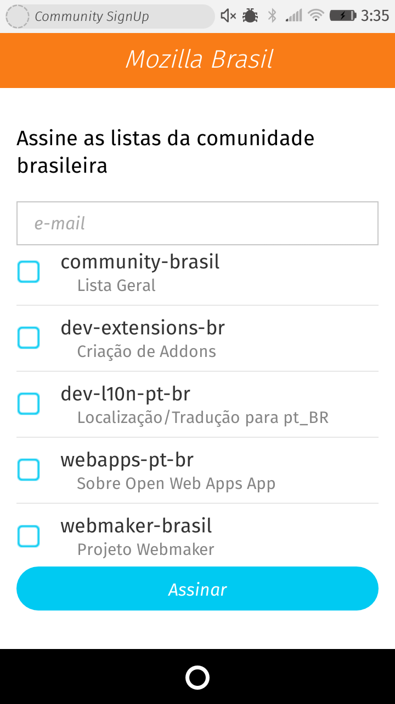
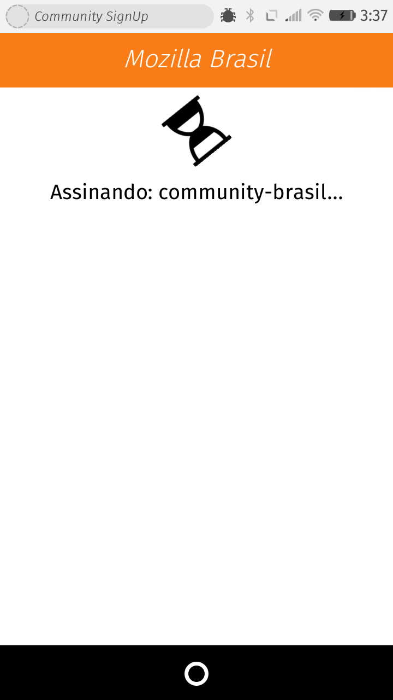
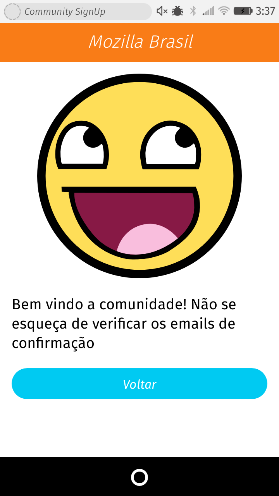

# Community SignUp Open Web App
This is a simple open web app to signup new volunteers into community mailing lists. It can be used by any Mozilla Community to suit their own needs by simple changing the information inside the [application configuration file](app/config.js) to their locale and info.

Currently this application can only subscribe to mailing lists hosted in the Mozilla mailing list infrastructure. In the short future I plan to change that so that communities can add lists hosted elsewhere.

The app cannot verify if the email is real and if the subscription process went through. It will only verify if mailman responded with 200 OK.

# How to add it to your Firefox OS device

Use the Web IDE to add an **packeg open web app** and select the manifest file inside the app folder.

# Screenshots from the app
Below are some shots from the app

## Main screen

This is the main screen of the app. It allows one to enter an email and select multiple mailing lists.

## Progress screen

This screen is show during subscription process. It has a spinning hourglass and displays the name/id of the current mailing list it is communicating with.

## Success screen

If the communication with mailman is successful then it displays this page with a reminder to check the confirmation emails.

# How does it work
Basically is sends a POST request to mailman with the email entered in the UI. The user will receive confirmation requests from each of the lists and needs to reply/confirm each one before they are effectively subscribed.

# Image use
Uses smiley from [East718 user](https://commons.wikimedia.org/wiki/File:718smiley.svg) from Wikipedia with CC license.
