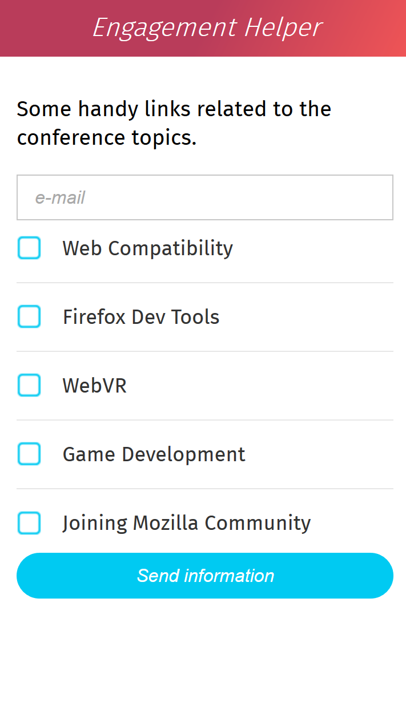

# Mozilla Community Engagement Helper Open Web App
This is a simple open web app to help Mozillians engage with event audiences and exchange useful data with them.

## Online version:
[click here to launch the online version](https://soapdog.github.io/openwebapp-event-engagement-helper)

# How does it work
Basically it allows you to type in the email of the person you're talking to and select which topics they are interested in. It launches your default email client with the pre-filled information for such topics.

# Screenshots

# Image use
Uses smiley from [East718 user](https://commons.wikimedia.org/wiki/File:718smiley.svg) from Wikipedia with CC license.
